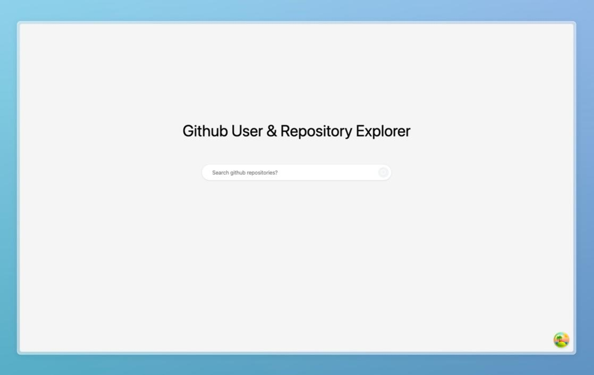

# Github Search

This is a github search app built with React, Shadcn UI and Tailwind CSS.




## Tech Stack

**UI:**
- [ShadcnUI](https://ui.shadcn.com) (TailwindCSS + RadixUI)
- [Search Bar](https://ui.shadcn.com/components/search-bar) (With tweak components to match the design)
- [Accordion](https://ui.shadcn.com/components/accordion) (With tweak components to match the design) 

**Animation:** [Framer Motion](https://framermotion.framer.website/)

**Build Tool:** [Vite](https://vitejs.dev/)


**Type Checking:** [TypeScript](https://www.typescriptlang.org/)

**Linting/Formatting:** [Eslint](https://eslint.org/) & [Prettier](https://prettier.io/)

**Icons:** [Lucide Icons](https://lucide.dev/)

## Run Locally

Minimal setup requirements

**NodeJS:** v18.16.0

**Yarn:** v1.22.19

Clone the project

```bash
  git clone https://github.com/latif5/github-search.git
```

Go to the project directory

```bash
  cd github-search
```

Install dependencies

```bash
  npm install
```

Start the server

```bash
  npm run dev
```


## License

Licensed under the [MIT License](https://choosealicense.com/licenses/mit/)